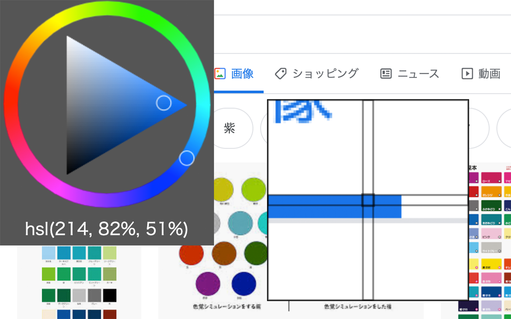

# ColorPicker with ColorCircle

https://chrome.google.com/webstore/detail/colorpicker-with-colorcir/ibpfjoicndbgalmjigfplcdjoabhdmnh

カラーサークル上でのピクセル値の位置が見えるカラーピッカーです。
拡張機能のアイコンをクリックすることで起動します。
表示中のwebページのカーソル上のピクセル値をカラーサークルの位置と共に調べることができます。